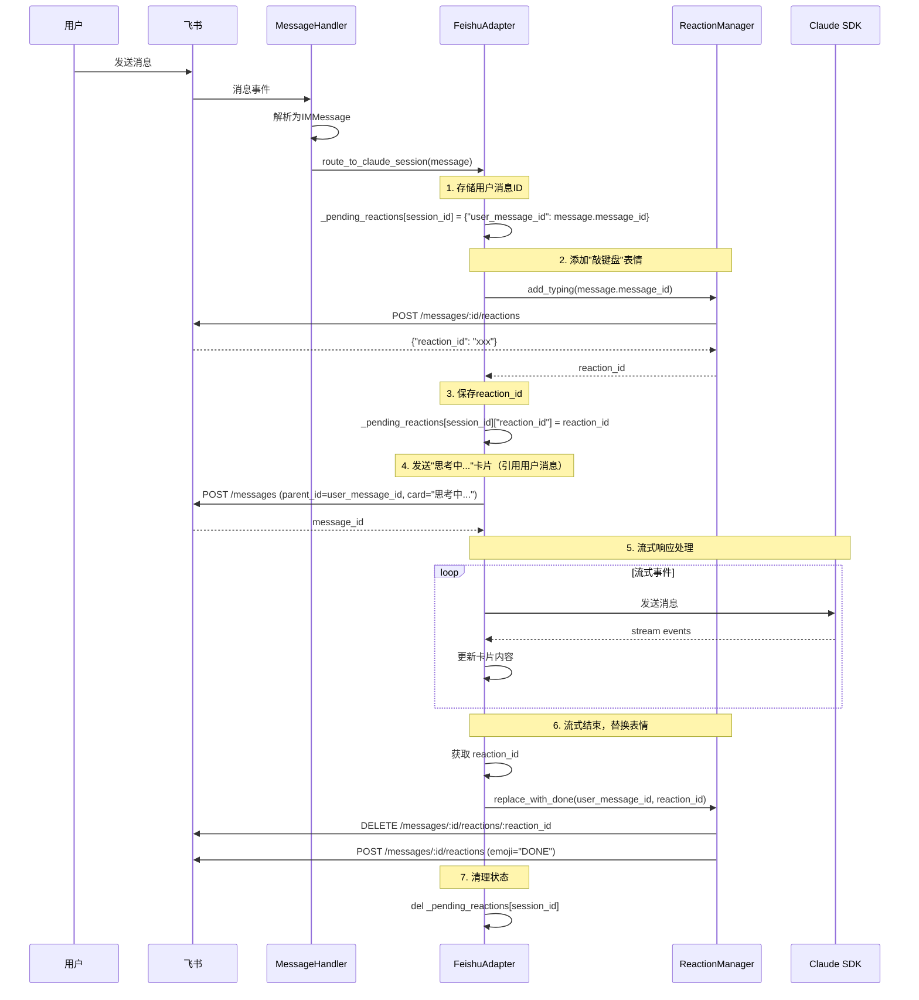

# 飞书消息表情反应增强设计文档

**日期**: 2026-03-12
**状态**: 设计阶段
**作者**: Claude
**审核者**: 待定

## 1. 概述

### 1.1 背景

当前系统在接收用户消息时，AI会发送"思考中..."的卡片消息。为了提升用户体验和消息链的可追溯性，需要进行以下优化：

1. **引用用户消息**：AI发送的"思考中..."卡片应该引用用户消息，便于在飞书中追踪完整的消息链
2. **敲键盘表情**：AI开始处理时，在用户消息上添加"敲键盘"表情反应
3. **完成表情**：AI完成所有对话内容后，将"敲键盘"表情替换为"完成"表情

### 1.2 目标

- 提升消息链的可追溯性，用户可以清楚看到AI的回复针对的是哪条消息
- 提供实时的处理状态反馈（敲键盘 → 完成）
- 确保表情操作失败不影响主流程

### 1.3 范围

- 创建独立的`FeishuReactionManager`服务类管理表情操作
- 修改`FeishuAdapter`集成表情管理功能
- 实现状态管理机制跟踪会话的表情状态
- 完善错误处理和日志记录

## 2. 架构设计

### 2.1 整体架构

```
┌─────────────────────────────────────────────────────────────┐
│                     FeishuAdapter                           │
│  ┌───────────────────────────────────────────────────────┐  │
│  │  消息处理流程                                          │  │
│  │  1. 接收消息 → 2. 添加Typing → 3. 发送"思考中..."卡   │  │
│  │     片（引用parent_id） → 4. 流式响应 → 5. 替换为Done  │  │
│  └───────────────────────────────────────────────────────┘  │
│                           │                                 │
│                           ▼                                 │
│  ┌───────────────────────────────────────────────────────┐  │
│  │              FeishuReactionManager (新增)              │  │
│  │  - add_typing(message_id) → reaction_id               │  │
│  │  - replace_with_done(message_id, reaction_id)         │  │
│  │  - add_reaction(message_id, emoji_type)               │  │
│  │  - delete_reaction(message_id, reaction_id)           │  │
│  └───────────────────────────────────────────────────────┘  │
│                           │                                 │
│                           ▼                                 │
│  ┌───────────────────────────────────────────────────────┐  │
│  │              lark_oapi SDK                            │  │
│  │  - CreateMessageReactionRequest                       │  │
│  │  - DeleteMessageReactionRequest                       │  │
│  └───────────────────────────────────────────────────────┘  │
└─────────────────────────────────────────────────────────────┘
```

### 2.2 文件结构

```
src/bridges/feishu/
├── adapter.py                    # 修改：添加reaction_manager和状态管理
├── reaction_manager.py           # 新增：表情管理服务
├── card_builder.py               # 不变
└── message_handler.py            # 不变
```

## 3. 组件设计

### 3.1 FeishuReactionManager 类

**职责**：封装所有与飞书Reaction API的交互，提供简洁的高级方法。

**文件位置**: `src/bridges/feishu/reaction_manager.py`

```python
from typing import Optional
from lark_oapi.api.im.v1 import CreateMessageReactionRequest, DeleteMessageReactionRequest
import structlog

logger = structlog.get_logger(__name__)


class FeishuReactionManager:
    """飞书消息表情反应管理器"""

    # 表情类型常量
    EMOJI_TYPING = "Typing"
    EMOJI_DONE = "DONE"

    def __init__(self, http_client, bot_user_id: str):
        """
        初始化表情管理器

        Args:
            http_client: 飞书HTTP客户端
            bot_user_id: 机器人的user_id，用于指定操作者
        """
        self._http_client = http_client
        self._bot_user_id = bot_user_id

    async def add_typing(self, message_id: str) -> Optional[str]:
        """
        为消息添加"敲键盘"表情反应

        Args:
            message_id: 消息ID

        Returns:
            reaction_id: 表情反应ID，失败返回None

        Raises:
            RuntimeError: 添加表情失败时
        """
        return await self.add_reaction(message_id, self.EMOJI_TYPING)

    async def replace_with_done(self, message_id: str, reaction_id: str) -> bool:
        """
        将"敲键盘"表情替换为"完成"表情

        Args:
            message_id: 消息ID
            reaction_id: 要删除的"敲键盘"表情ID

        Returns:
            bool: 成功返回True，失败返回False
        """
        try:
            # 先删除Typing表情
            await self.delete_reaction(message_id, reaction_id)
            # 添加Done表情
            await self.add_reaction(message_id, self.EMOJI_DONE)
            return True
        except Exception as e:
            logger.error(f"替换表情失败: {e}", exc_info=True)
            return False

    async def add_reaction(self, message_id: str, emoji_type: str) -> Optional[str]:
        """
        通用方法：添加表情反应

        Args:
            message_id: 消息ID
            emoji_type: 表情类型（如"Typing", "DONE"）

        Returns:
            reaction_id: 表情反应ID，失败返回None
        """
        try:
            request = CreateMessageReactionRequest.builder() \
                .message_id(message_id) \
                .request_body(
                    ReactionType.builder()
                        .emoji_type(emoji_type)
                        .build()
                ) \
                .operator_id(self._bot_user_id) \
                .operator_type("user") \
                .build()

            response = await self._http_client.im.v1.message_reaction.create(request)

            if response.code == 0 and response.data:
                reaction_id = response.data.reaction_id
                logger.info(f"成功添加表情 {emoji_type} 到消息 {message_id}, reaction_id: {reaction_id}")
                return reaction_id
            else:
                logger.error(f"添加表情失败: code={response.code}, msg={response.msg}")
                return None

        except Exception as e:
            logger.error(f"添加表情异常: {e}", exc_info=True)
            return None

    async def delete_reaction(self, message_id: str, reaction_id: str) -> bool:
        """
        通用方法：删除表情反应

        Args:
            message_id: 消息ID
            reaction_id: 表情反应ID

        Returns:
            bool: 成功返回True，失败返回False
        """
        try:
            request = DeleteMessageReactionRequest.builder() \
                .message_id(message_id) \
                .reaction_id(reaction_id) \
                .operator_id(self._bot_user_id) \
                .operator_type("user") \
                .build()

            response = await self._http_client.im.v1.message_reaction.delete(request)

            if response.code == 0:
                logger.info(f"成功删除表情 reaction_id: {reaction_id}")
                return True
            else:
                logger.error(f"删除表情失败: code={response.code}, msg={response.msg}")
                return False

        except Exception as e:
            logger.error(f"删除表情异常: {e}", exc_info=True)
            return False
```

**设计要点**：
- **职责单一**：只负责表情的增删操作，不涉及业务逻辑
- **错误处理**：所有方法都捕获异常并记录日志，不会因表情操作失败影响主流程
- **可扩展性**：`add_reaction`和`delete_reaction`是通用方法，未来可以轻松添加新的表情类型
- **常量定义**：`EMOJI_TYPING`和`EMOJI_DONE`作为类常量，避免硬编码

### 3.2 FeishuAdapter 修改

**状态存储**：

```python
class FeishuAdapter:
    def __init__(self, ...):
        # ... 现有初始化代码 ...

        # 新增：表情管理器
        self.reaction_manager = FeishuReactionManager(
            http_client=self._http_client,
            bot_user_id=self.bot_user_id
        )

        # 新增：状态管理 - 存储每个会话的表情信息
        # 结构: {session_id: {"user_message_id": str, "reaction_id": str}}
        self._pending_reactions: Dict[str, Dict[str, str]] = {}
```

**核心修改 - handle_message_for_claude方法**：

```python
async def handle_message_for_claude(self, message: IMMessage) -> None:
    """将消息路由到Claude会话并处理响应"""

    session_id = message.session_id
    user_message_id = message.message_id  # 新增：保存用户消息ID

    try:
        # ... 现有的会话创建/获取逻辑 ...

        # ===== 新增代码开始 =====
        # 步骤1: 添加"敲键盘"表情
        reaction_id = await self.reaction_manager.add_typing(user_message_id)

        # 步骤2: 存储状态
        if reaction_id:
            self._pending_reactions[session_id] = {
                "user_message_id": user_message_id,
                "reaction_id": reaction_id
            }
        # ===== 新增代码结束 =====

        # 步骤3: 发送"思考中..."卡片（引用用户消息）
        initial_card = self.card_builder.create_message_card("思考中...")
        logger.info(f"发送初始卡片: 思考中...")
        card_message_id = await self.send_message(
            session_id=session_id,
            content=initial_card,
            message_type=MessageType.CARD,
            receive_id_type="chat_id",
            parent_id=user_message_id  # 新增：引用用户消息
        )

        # ... 现有的流式处理逻辑 ...

        # ===== 新增代码开始 =====
        # 步骤4: 流式结束后替换表情
        await self._finalize_reaction(session_id)
        # ===== 新增代码结束 =====

    except Exception as e:
        logger.error(f"处理消息失败: {e}", exc_info=True)
        # 确保清理状态
        await self._finalize_reaction(session_id)
        # 发送错误提示
        await self._send_error_message(session_id, str(e))
```

**新增辅助方法**：

```python
async def _finalize_reaction(self, session_id: str) -> None:
    """
    完成会话时的表情处理：移除Typing，添加Done

    Args:
        session_id: 会话ID
    """
    reaction_info = self._pending_reactions.get(session_id)

    if not reaction_info:
        logger.warning(f"未找到会话 {session_id} 的表情信息")
        return

    try:
        user_message_id = reaction_info["user_message_id"]
        reaction_id = reaction_info["reaction_id"]

        # 替换表情：Typing -> Done
        success = await self.reaction_manager.replace_with_done(
            user_message_id,
            reaction_id
        )

        if success:
            logger.info(f"会话 {session_id} 表情替换成功")
        else:
            logger.warning(f"会话 {session_id} 表情替换失败")

    except Exception as e:
        logger.error(f"完成表情处理失败: {e}", exc_info=True)
    finally:
        # 清理状态
        self._pending_reactions.pop(session_id, None)
```

## 4. 数据流

### 4.1 完整消息处理时序



## 5. 错误处理

### 5.1 错误场景与处理策略

| 场景 | 飞书错误码 | 处理策略 |
|------|-----------|---------|
| 用户消息已被删除 | 231003 | 记录警告日志，返回None，不影响主流程 |
| 机器人不在会话中 | 231002, 231008 | 记录错误日志，返回None，不影响主流程 |
| 消息类型不支持 | 231017 | 记录错误日志，返回None |
| 表情添加失败 | 其他 | 记录错误日志，返回None，继续发送卡片 |
| 流式响应异常 | - | 在finally中清理表情状态 |

### 5.2 容错设计原则

1. **表情操作不阻塞主流程**：所有表情操作失败都不应影响AI回复
2. **状态清理保证**：使用try-finally确保状态最终被清理
3. **幂等性**：`_finalize_reaction`可以安全地多次调用
4. **日志完善**：所有错误都有详细的日志记录，便于排查问题

## 6. 测试策略

### 6.1 单元测试

**文件**: `tests/bridges/feishu/test_reaction_manager.py`

```python
import pytest
from unittest.mock import AsyncMock, Mock
from src.bridges.feishu.reaction_manager import FeishuReactionManager

class TestFeishuReactionManager:

    @pytest.mark.asyncio
    async def test_add_typing_success(self):
        """测试成功添加敲键盘表情"""
        mock_http_client = AsyncMock()
        mock_response = Mock()
        mock_response.code = 0
        mock_response.data.reaction_id = "test_reaction_123"
        mock_http_client.im.v1.message_reaction.create.return_value = mock_response

        manager = FeishuReactionManager(mock_http_client, "bot_123")
        reaction_id = await manager.add_typing("msg_456")

        assert reaction_id == "test_reaction_123"

    @pytest.mark.asyncio
    async def test_add_typing_failure(self):
        """测试添加表情失败"""
        mock_http_client = AsyncMock()
        mock_response = Mock()
        mock_response.code = 231003  # 消息不存在
        mock_http_client.im.v1.message_reaction.create.return_value = mock_response

        manager = FeishuReactionManager(mock_http_client, "bot_123")
        reaction_id = await manager.add_typing("msg_456")

        assert reaction_id is None

    @pytest.mark.asyncio
    async def test_replace_with_done(self):
        """测试替换表情流程"""
        mock_http_client = AsyncMock()
        mock_http_client.im.v1.message_reaction.delete.return_value = Mock(code=0)
        mock_http_client.im.v1.message_reaction.create.return_value = Mock(code=0)

        manager = FeishuReactionManager(mock_http_client, "bot_123")
        success = await manager.replace_with_done("msg_456", "reaction_123")

        assert success is True
```

### 6.2 集成测试

**文件**: `tests/bridges/feishu/test_adapter_integration.py`

```python
import pytest
from unittest.mock import AsyncMock, Mock
from src.bridges.feishu.adapter import FeishuAdapter

class TestFeishuAdapterReactionIntegration:

    @pytest.mark.asyncio
    async def test_full_message_flow_with_reactions(self):
        """测试完整的消息处理流程（包含表情）"""
        adapter = self._create_adapter_with_mocks()
        message = self._create_test_message("user_msg_123")

        adapter.reaction_manager.add_typing = AsyncMock(return_value="reaction_456")
        adapter.reaction_manager.replace_with_done = AsyncMock(return_value=True)

        claude_events = [
            Mock(type="content_delta", delta="Hello"),
            Mock(type="content_delta", delta=" World"),
            Mock(type="stop")
        ]
        adapter.claude_adapter.send_message = AsyncMock(return_value=claude_events)

        await adapter.handle_message_for_claude(message)

        adapter.reaction_manager.add_typing.assert_called_once_with("user_msg_123")
        adapter.reaction_manager.replace_with_done.assert_called_once_with("user_msg_123", "reaction_456")
        assert "session_123" not in adapter._pending_reactions

    @pytest.mark.asyncio
    async def test_reaction_failure_does_not_break_flow(self):
        """测试表情添加失败不影响主流程"""
        adapter = self._create_adapter_with_mocks()
        message = self._create_test_message("user_msg_123")

        adapter.reaction_manager.add_typing = AsyncMock(return_value=None)
        claude_events = [Mock(type="stop")]
        adapter.claude_adapter.send_message = AsyncMock(return_value=claude_events)

        await adapter.handle_message_for_claude(message)

        adapter.claude_adapter.send_message.assert_called_once()
        adapter.reaction_manager.replace_with_done.assert_not_called()
```

### 6.3 手动测试清单

- [ ] 发送消息后，用户消息上出现"敲键盘"表情
- [ ] AI回复的"思考中..."卡片正确引用了用户消息
- [ ] AI回复完成后，"敲键盘"表情消失，出现"完成"表情
- [ ] 快速连续发送多条消息，每条消息的表情都正确
- [ ] AI回复过程中网络异常，表情状态正确处理
- [ ] 用户消息被撤回，表情操作不报错
- [ ] 机器人不在群组中，添加表情失败不影响AI回复

## 7. API参考

### 7.1 飞书表情回复API

**添加表情**：
- URL: `POST https://open.feishu.cn/open-apis/im/v1/messages/:message_id/reactions`
- 请求体:
  ```json
  {
    "reaction_type": {
      "emoji_type": "Typing"
    }
  }
  ```
- 响应:
  ```json
  {
    "code": 0,
    "data": {
      "reaction_id": "xxx"
    }
  }
  ```

**删除表情**：
- URL: `DELETE https://open.feishu.cn/open-apis/im/v1/messages/:message_id/reactions/:reaction_id`

**表情类型**：
- `Typing` - 敲键盘
- `DONE` - 完成

更多表情类型参考：[飞书表情文案说明](https://open.feishu.cn/document/server-docs/im-v1/message-reaction/emojis-introduce)

## 8. 实施计划

详细的实施计划将由 `writing-plans` skill 生成，包括：

1. 创建 `reaction_manager.py` 文件
2. 编写单元测试
3. 修改 `adapter.py` 集成表情管理
4. 编写集成测试
5. 本地测试验证
6. 代码审查
7. 合并到主分支

## 9. 风险与依赖

### 9.1 风险

| 风险 | 影响 | 缓解措施 |
|------|------|---------|
| 飞书API变更 | 中 | 使用官方SDK，封装调用逻辑 |
| 表情操作失败率高 | 低 | 完善错误处理，不影响主流程 |
| 状态管理复杂度 | 低 | 使用简单字典结构，定期清理 |

### 9.2 依赖

- lark_oapi SDK（已存在）
- structlog（已存在）
- 飞书机器人已开启表情权限

## 10. 参考资料

- [飞书添加消息表情回复API](https://open.feishu.cn/document/server-docs/im-v1/message-reaction/create)
- [飞书表情类型枚举](https://open.feishu.cn/document/server-docs/im-v1/message-reaction/emojis-introduce)
- [lark_oapi Python SDK文档](https://github.com/larksuite/oapi-sdk-python)
